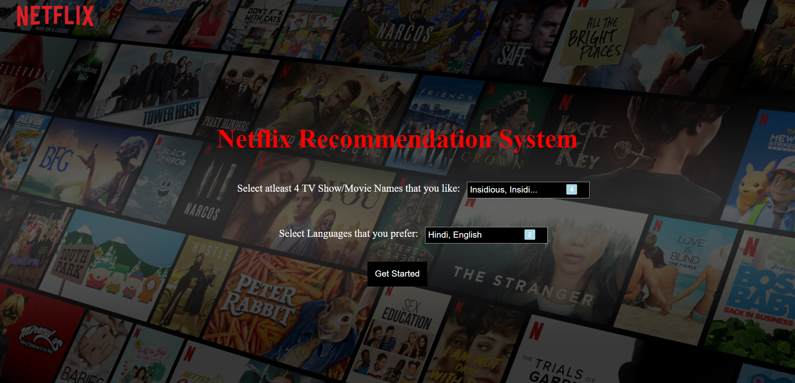
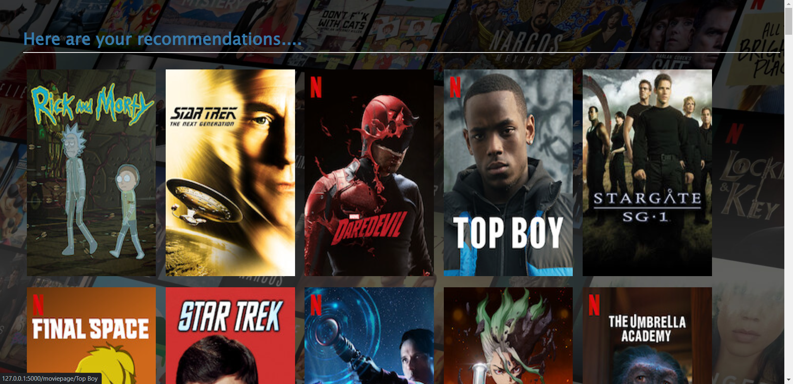
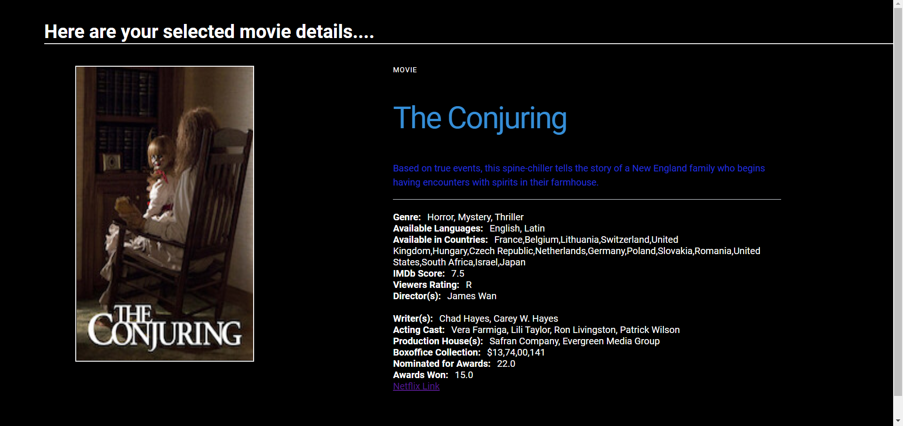
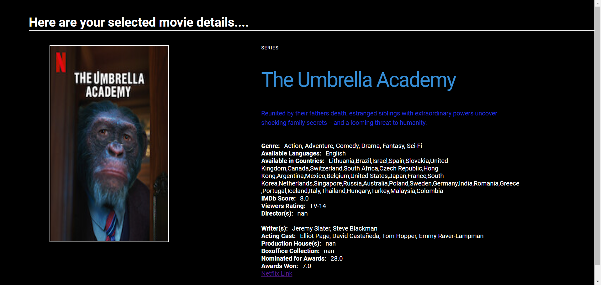
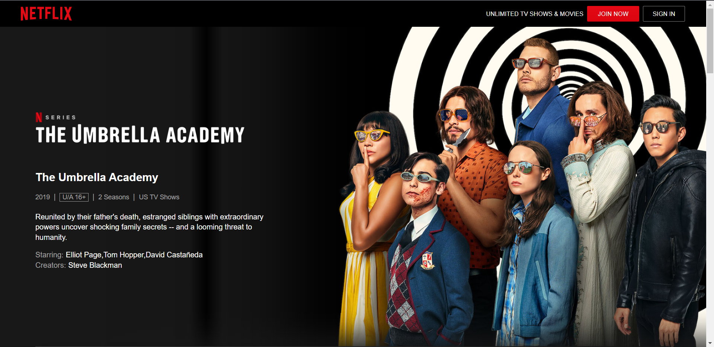

# 🎬 Netflix Movie Recommendation System

##  Overview

This project implements a **content-based movie recommendation system** that suggests movies or series based on user preferences.

The system analyzes movie metadata such as:

* Genre
* Tags
* Actors
* Viewer ratings

and recommends similar content using **machine learning techniques**.

A **Flask-based web application** is developed to provide an interactive user interface.

---

##  Features

* Select movies or series of interest
* Choose preferred language
* Get top recommended movies instantly
* View detailed information of each movie
* Interactive web interface

---

##  Machine Learning Approach

This project uses a **Content-Based Filtering** approach:

### 1. Feature Engineering

Multiple features are combined into a single representation:

* Genre
* Tags
* Actors
* Viewer Rating

### 2. Text Processing

* Converted all features into lowercase
* Removed spaces and formatted text

### 3. Vectorization

* Used **CountVectorizer** from Scikit-learn
* Converted textual data into numerical vectors

### 4. Similarity Calculation

* Applied **Cosine Similarity**
* Measured similarity between movies

### 5. Recommendation

* Ranked movies based on similarity scores
* Returned top similar movies

---

## 🛠️ Tech Stack

* **Programming Language:** Python
* **Backend:** Flask
* **Libraries:**

  * Pandas
  * Scikit-learn
  * NumPy
* **Frontend:** HTML, CSS, JavaScript

---

## 📂 Project Structure

```bash
Netflix-Recommendation-System
│
├── app/
│   ├── app.py
│   ├── NetflixDataset.csv
│   ├── templates/
│   └── static/
│
├── README.md
└── requirements.txt
```

---

##  Application Pages

###  Home Page

Users can select their favorite movies/series and preferred language.



---

###  Recommendation Page

Displays recommended movies sorted based on similarity and ratings.




---

###  Movie Detail Page

Shows complete details such as:

* Genre
* Summary
* Language
* IMDb rating
* Cast and crew




---

###  Netflix Page

Redirects to Netflix for watching selected content.



---

## ⚙️ How to Run the Project

1. Clone the repository:

```bash
git clone https://github.com/rohithg-codes/netflix-movie-recommendation-system.git
```

2. Navigate to project folder:

```bash
cd netflix-movie-recommendation-system/app
```

3. Install dependencies:

```bash
pip install -r requirements.txt
```

4. Run the application:

```bash
python app.py
```

5. Open in browser:

```
http://127.0.0.1:5000
```

---

##  Future Improvements

* Add collaborative filtering
* Improve recommendation accuracy
* Deploy the application on cloud
* Enhance UI/UX

---

##  Learning Outcomes

* Understanding of **content-based recommendation systems**
* Practical experience with **Scikit-learn and NLP techniques**
* Building and deploying **Flask applications**
* Handling real-world datasets

---

## 👤 Author

**Rohith Gottam**

* GitHub: https://github.com/rohithg-codes

---

## ⭐ Show Your Support

If you found this project useful, consider giving it a ⭐ on GitHub!
